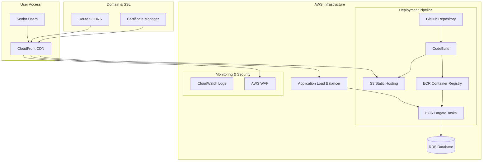

# AWS Deployment Design Document

## Overview

The BuddyMate senior companion app will be deployed to AWS using a modern, scalable architecture optimized for React-based web applications. The deployment will leverage AWS's content delivery network, static hosting capabilities, and automated deployment pipelines to provide a fast, reliable, and cost-effective solution for serving the application to senior users worldwide.

The architecture follows AWS best practices for static web applications with dynamic features, utilizing services that provide automatic scaling, high availability, and built-in security features while maintaining cost efficiency for a senior-focused application.

## Architecture

### High-Level Architecture



### Deployment Strategy

**Primary Approach: Static Site with API Backend**
- **Frontend**: S3 + CloudFront for static React build
- **Backend Services**: ECS Fargate for any dynamic functionality
- **Database**: RDS for persistent data (if needed)
- **CDN**: CloudFront for global content delivery

**Alternative Approach: Amplify Hosting**
- AWS Amplify for simplified full-stack deployment
- Integrated CI/CD pipeline
- Built-in domain management and SSL

## Components and Interfaces

### 1. Frontend Hosting (S3 + CloudFront)

**S3 Bucket Configuration:**
- Static website hosting enabled
- Public read access for web content
- Versioning enabled for rollback capability
- Lifecycle policies for cost optimization

**CloudFront Distribution:**
- Global edge locations for low latency
- HTTPS redirect enforcement
- Custom error pages for SPA routing
- Compression enabled for faster loading
- Cache policies optimized for React apps

**Key Features:**
- Automatic HTTPS with AWS Certificate Manager
- Custom domain support via Route 53
- Geographic restrictions if needed
- Real-time logs and metrics

### 2. Build and Deployment Pipeline

**CodeBuild Project:**
- Source: GitHub repository integration
- Build environment: Node.js 18+ with webpack
- Build commands:
  ```bash
  npm install
  npm run build:web
  aws s3 sync dist/ s3://buddymate-app-bucket --delete
  aws cloudfront create-invalidation --distribution-id $DISTRIBUTION_ID --paths "/*"
  ```

**GitHub Integration:**
- Webhook triggers on main branch pushes
- Automated testing before deployment
- Build status notifications
- Rollback capabilities

### 3. Domain and SSL Management

**Route 53 Configuration:**
- Custom domain: `app.buddymate.com` (or similar)
- DNS routing to CloudFront distribution
- Health checks for availability monitoring

**Certificate Manager:**
- SSL/TLS certificate for HTTPS
- Automatic renewal
- Multi-domain support if needed

### 4. Monitoring and Logging

**CloudWatch Integration:**
- Application performance monitoring
- Error tracking and alerting
- User access patterns
- Cost monitoring and alerts

**AWS WAF (Web Application Firewall):**
- Protection against common web exploits
- Rate limiting for DDoS protection
- Geographic blocking if required
- Custom security rules

## Data Models

### Deployment Configuration

```typescript
interface DeploymentConfig {
  environment: 'development' | 'staging' | 'production';
  region: string;
  bucketName: string;
  distributionId: string;
  domainName: string;
  certificateArn: string;
}

interface BuildConfiguration {
  nodeVersion: string;
  buildCommand: string;
  outputDirectory: string;
  environmentVariables: Record<string, string>;
}
```

### Infrastructure as Code

The deployment will use AWS CloudFormation or CDK for infrastructure management:

```yaml
# CloudFormation template structure
Resources:
  BuddyMateS3Bucket:
    Type: AWS::S3::Bucket
    Properties:
      WebsiteConfiguration:
        IndexDocument: index.html
        ErrorDocument: index.html
      
  BuddyMateCloudFrontDistribution:
    Type: AWS::CloudFront::Distribution
    Properties:
      DistributionConfig:
        Origins:
          - DomainName: !GetAtt BuddyMateS3Bucket.RegionalDomainName
            Id: S3Origin
            S3OriginConfig:
              OriginAccessIdentity: !Ref OriginAccessIdentity
```

## Error Handling

### Deployment Error Handling

1. **Build Failures:**
   - Automatic retry mechanisms
   - Notification to development team
   - Preservation of previous working version
   - Detailed error logging in CloudWatch

2. **Runtime Errors:**
   - Custom error pages for 404/500 errors
   - Client-side error boundary integration
   - Automatic failover to cached content
   - User-friendly error messages for seniors

3. **Infrastructure Failures:**
   - Multi-AZ deployment for high availability
   - Automatic scaling based on demand
   - Health checks and automatic recovery
   - Backup and disaster recovery procedures

### Monitoring and Alerting

```typescript
interface MonitoringConfig {
  errorThreshold: number;
  responseTimeThreshold: number;
  availabilityTarget: number; // 99.9%
  alertingChannels: string[];
}
```

## Testing Strategy

### Pre-Deployment Testing

1. **Build Verification:**
   - Automated build testing in CodeBuild
   - Bundle size optimization checks
   - Security vulnerability scanning
   - Performance benchmarking

2. **Staging Environment:**
   - Identical infrastructure to production
   - User acceptance testing
   - Load testing with simulated senior user patterns
   - Accessibility testing in deployed environment

3. **Production Deployment:**
   - Blue-green deployment strategy
   - Canary releases for major updates
   - Automated rollback triggers
   - Real-time monitoring during deployment

### Post-Deployment Validation

```typescript
interface DeploymentValidation {
  healthChecks: {
    endpoint: string;
    expectedStatus: number;
    timeout: number;
  }[];
  performanceMetrics: {
    loadTime: number;
    firstContentfulPaint: number;
    largestContentfulPaint: number;
  };
  accessibilityChecks: {
    wcagCompliance: boolean;
    screenReaderCompatibility: boolean;
    keyboardNavigation: boolean;
  };
}
```

## Security Considerations

### AWS Security Best Practices

1. **IAM Roles and Policies:**
   - Least privilege access principles
   - Service-specific roles for CodeBuild, S3, CloudFront
   - No hardcoded credentials in code

2. **Network Security:**
   - HTTPS enforcement across all endpoints
   - WAF rules for common attack patterns
   - VPC configuration for backend services (if applicable)

3. **Data Protection:**
   - Encryption at rest for S3 storage
   - Encryption in transit via HTTPS
   - Secure headers configuration in CloudFront

### Application Security

```typescript
interface SecurityConfig {
  contentSecurityPolicy: string;
  httpsRedirect: boolean;
  securityHeaders: {
    xFrameOptions: string;
    xContentTypeOptions: string;
    referrerPolicy: string;
  };
}
```

## Cost Optimization

### Estimated Monthly Costs (Low Traffic)

- **S3 Storage**: $1-5 (depending on assets)
- **CloudFront**: $1-10 (based on data transfer)
- **Route 53**: $0.50 per hosted zone
- **Certificate Manager**: Free
- **CodeBuild**: $0.005 per build minute
- **Total Estimated**: $5-20/month for typical usage

### Cost Optimization Strategies

1. **S3 Lifecycle Policies:**
   - Transition old versions to cheaper storage classes
   - Automatic deletion of incomplete uploads

2. **CloudFront Optimization:**
   - Appropriate cache policies
   - Compression enabled
   - Regional edge caches

3. **Monitoring and Alerts:**
   - Cost anomaly detection
   - Usage-based scaling
   - Regular cost reviews

## Performance Optimization

### Frontend Optimization

1. **Build Optimization:**
   - Code splitting for faster initial loads
   - Tree shaking to remove unused code
   - Asset optimization (images, fonts)
   - Gzip compression

2. **CDN Configuration:**
   - Optimal cache headers
   - Edge locations worldwide
   - HTTP/2 support
   - Brotli compression

### Senior User Experience

```typescript
interface PerformanceTargets {
  firstContentfulPaint: 1.5; // seconds
  largestContentfulPaint: 2.5; // seconds
  cumulativeLayoutShift: 0.1;
  firstInputDelay: 100; // milliseconds
}
```

The design prioritizes simplicity, reliability, and cost-effectiveness while ensuring the BuddyMate app remains fully functional and accessible to senior users through a globally distributed, secure AWS infrastructure.